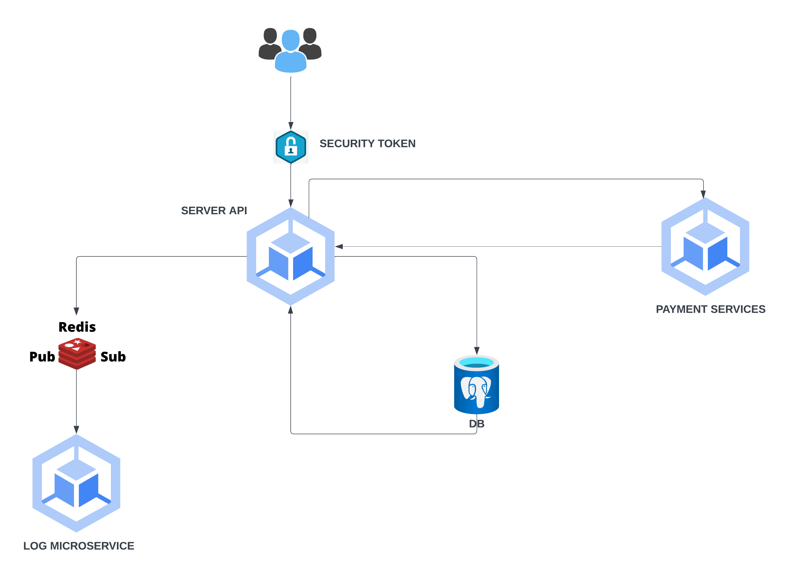

# payment-app

This is a simple simulation of a bank API service that can store user information and perform transaction.



## Endpoints

|Description        |URL                                                            |METHOD |
|-------------------|---------------------------------------------------------------|-------|
|Check-Health       |`http://localhost:8080/health`                                 |`GET`  |
|Register           |`http://localhost:8080/auth/register`                          |`POST` |
|Login              |`http://localhost:8080/auth/login`                             |`POST` |
|Transaction:New    |`http://localhost:8080/api/v1/payments/transaction`            |`POST` |
|Transaction:Refund |`http://localhost:8080/api/v1/payments/transaction/:id/refund` |`POST` |
|Transaction:Details|`http://localhost:8080/api/v1/payments/transaction/:id`        |`GET`  |
|Log Monitor        |`http://localhost:8083`                                        |`GET`  |

## Running app

```git
git clone git@github.com:asmejia1993/payment-app.git
```

```
cd payment-app
```

```
docker compose up -d
```

## Running test with cover

```go
go test -v -cover ./...
```
